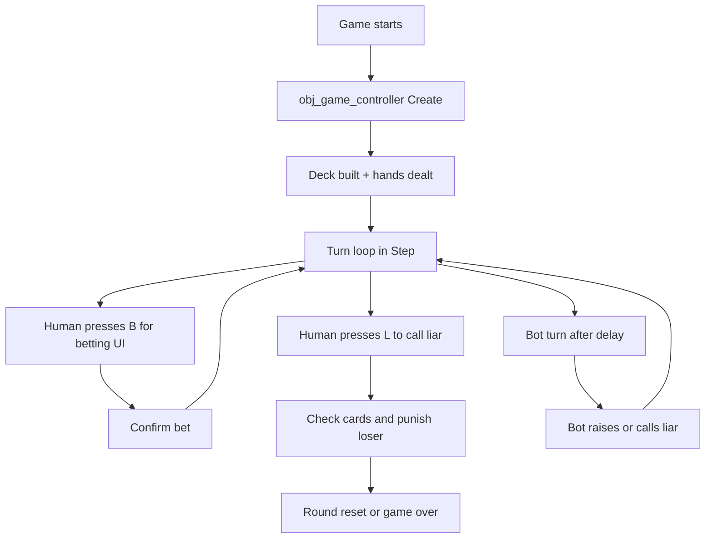

# Lying Poker Game Documentation

## Simple Flow

## Core Data
The game uses a few shared enums and structs: suits, poker hand ranks, game states, plus the `Card` and `Bet` structs. These are the base types used everywhere else in the project.
Location: [scripts/scr_definitions/scr_definitions.gml](scripts/scr_definitions/scr_definitions.gml)

## Game Setup
The controller creates the deck, shuffles it, deals the starting hands, sets the first player, marks bots, and starts the game state. It also builds the initial player hand visuals and spawns the opponent display object.
Location: [objects/obj_game_controller/Create_0.gml](objects/obj_game_controller/Create_0.gml)

## Turn System
The Step event is the main state machine. It handles waiting for input, opening the betting UI, passing the keyboard to the next player, and starting the bot timer.
Location: [objects/obj_game_controller/Step_0.gml](objects/obj_game_controller/Step_0.gml)

## Betting Rules
A new bet must beat the current bet. The helper compares rank strength, then value, and for some hands it also checks a second value like the second pair, full house kicker pair, or suit.
Location: [objects/obj_game_controller/Create_0.gml](objects/obj_game_controller/Create_0.gml) and [scripts/scr_poker_logic/scr_poker_logic.gml](scripts/scr_poker_logic/scr_poker_logic.gml)

## Betting UI
Pressing `B` opens the betting screen. Left and right clicks on the selector zones change the category and values, and `Enter` confirms only when the new bet is high enough.
Location: [objects/obj_betting_ui/Create_0.gml](objects/obj_betting_ui/Create_0.gml), [objects/obj_betting_ui/Step_0.gml](objects/obj_betting_ui/Step_0.gml), [objects/obj_betting_ui/Draw_0.gml](objects/obj_betting_ui/Draw_0.gml)

## Calling Liar
Pressing `L` checks whether the current bet is true. If the bet is false, the bettor takes a card; if it is true, the caller takes the card. The loser can be pushed into game over when they hit the loss limit, otherwise the round resets.
Location: [scripts/scr_poker_logic/scr_poker_logic.gml](scripts/scr_poker_logic/scr_poker_logic.gml)

## Bot Logic
The bot was the last major addition. It estimates whether the current bet is believable from its own hand and the total cards still in play, then either raises the bet or calls liar after a short delay.
Location: [objects/obj_game_controller/Create_0.gml](objects/obj_game_controller/Create_0.gml), [objects/obj_game_controller/Alarm_0.gml](objects/obj_game_controller/Alarm_0.gml)

## Card Display
Each card instance stores one `Card` struct and draws the correct frame from the 52-card sprite sheet. The controller rebuilds the visible hand whenever a round changes or a player takes a card.
Location: [objects/obj_card/Create_0.gml](objects/obj_card/Create_0.gml), [objects/obj_card/Draw_0.gml](objects/obj_card/Draw_0.gml), [objects/obj_game_controller/Create_0.gml](objects/obj_game_controller/Create_0.gml)

## Opponent Visuals
The opponent object is only visual. It picks the right sprite frame based on player count so the table matches the number of active players.
Location: [objects/obj_opponents/Create_0.gml](objects/obj_opponents/Create_0.gml), [objects/obj_opponents/Draw_0.gml](objects/obj_opponents/Draw_0.gml)

## Menu Buttons
The main menu buttons use sprite frames for New Game, Options, and Quit. Clicking the correct vertical area triggers the matching action.
Location: [objects/obj_menu_buttons/Mouse_4.gml](objects/obj_menu_buttons/Mouse_4.gml), [rooms/rm_main_menu/InstanceCreationCode_inst_5D88D145.gml](rooms/rm_main_menu/InstanceCreationCode_inst_5D88D145.gml), [rooms/rm_main_menu/InstanceCreationCode_inst_3E3A4D4F.gml](rooms/rm_main_menu/InstanceCreationCode_inst_3E3A4D4F.gml)

## Quick Mental Model
The game loop is: deal cards, let the active player bet or call liar, resolve the bet, then rotate turns. Most of the logic lives in the controller, while the other objects mostly handle UI and visuals.
Location: [objects/obj_game_controller/Create_0.gml](objects/obj_game_controller/Create_0.gml), [objects/obj_game_controller/Step_0.gml](objects/obj_game_controller/Step_0.gml), [scripts/scr_poker_logic/scr_poker_logic.gml](scripts/scr_poker_logic/scr_poker_logic.gml)
